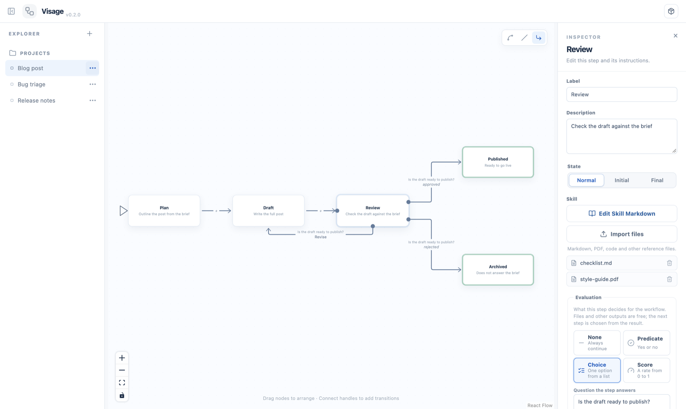
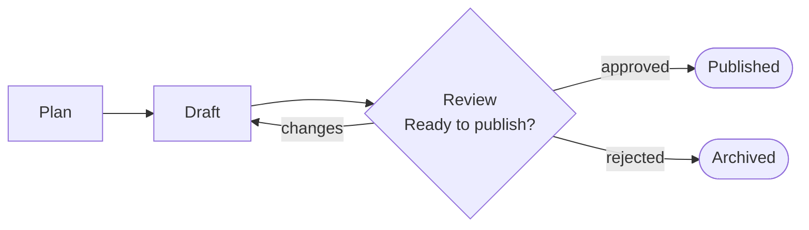

# Visage

**Design agent workflows as state machines of Skills, visually or through MCP, and ship them as Claude Code and Codex plugins.**

Long, multi-step instructions are fragile: agents skip steps, merge them, or carry on after a check has failed. Visage makes the process explicit. Each step is a Skill with its own instructions, each decision is a typed result, and a small runner tells the agent which step comes next, so the order and the checks hold every time.



## How it works

1. **Design** the workflow on a canvas, or let an agent build it through the `visage` MCP server. Every step gets a `SKILL.md` with its instructions and reference files.
2. **Decide** with typed results. A step can answer a yes/no question, pick one option, or give a score, and arcs route on that result.
3. **Export** a plugin. The agent follows an orchestrator Skill, executes one step at a time, and submits each result to a runner that validates it, retries with feedback when it is invalid, and picks the next step.

The workflow in the screenshot:



## Features

- **Visual editor**: drag steps, connect them, choose curved, straight or orthogonal lines, and edit each step's Skill in a Markdown editor with its reference files (PDFs, examples, code).
- **Typed evaluations**: `predicate` (true or false), `choice` (one option from a list) or `score` (0 to 1), with retries, failure routes, and warnings for results that have nowhere to go.
- **MCP server**: 19 tools let Claude Code, Codex or any MCP client create, edit, validate and export workflows, and open the editor on the project they are working on.
- **Portable plugins**: an export runs without Visage. It needs only Node.js, in Claude Code, in Codex, or with any agent that can run shell commands.
- **Testing**: scenarios check that scripted results take the path you designed, instantly and without an agent; a conformance kit runs a probe workflow through Claude Code, Codex or any CLI and audits that the agent followed every transition.
- **Shareable output**: export the canvas as a PNG or the flow as a Mermaid diagram for READMEs and pull requests.
- **Single process**: one Node.js file serves the editor, a REST API and MCP over stdio and HTTP. Visage itself installs as a plugin.

## Quick start

Requires [Node.js](https://nodejs.org) 20 or later.

```bash
git clone https://github.com/ilexistools/Visage.git
cd Visage/server
npm install
npm run package            # builds dist/visage (the plugin) and dist/visage-<version>.zip
```

**Claude Code**: start a session with the plugin, then ask for a workflow:

```bash
claude --plugin-dir dist/visage
```
> Create a Visage workflow that plans, writes and reviews a blog post, and open it in the editor.

**Codex**: add `server/dist/visage` as a local plugin.

**Editor only**: `node dist/visage/server/visage.js --open` opens [http://127.0.0.1:4317](http://127.0.0.1:4317).

**Other MCP clients**:

```bash
claude mcp add visage -- node /path/to/Visage/server/dist/visage/server/visage.js --stdio
```

## Evaluations

An evaluated step ends with a JSON object such as `{"result": "approved", "reason": "Covers the brief"}`. It can also write files and return other keys, but only `result` chooses the next step.

| Type | `result` | Arcs route on |
| --- | --- | --- |
| `predicate` | `true` or `false` | `output.result == true`, `output.result == false` |
| `choice` | one of `options` | `output.result == "approved"` |
| `score` | a number from 0 to 1 | `output.result >= 0.8`, best threshold first |

The last arc of a step can have no condition and act as *otherwise*. When a result is invalid, the step is tried again with the validation error as feedback, up to `max_attempts` times in total, then goes to `on_fail`.

A project is a folder you can version with Git:

```
blog-post/
  workflow.yaml             # steps, evaluations and arcs
  skills/plan/SKILL.md      # instructions for each step
  skills/review/SKILL.md
  skills/review/checklist.md
  dist/blog-post/           # exported plugin
```

## Testing

**Scenarios** script each step's result and the path you expect. They run in the editor (flask button), through the `test_workflow` MCP tool, or in CI, with the same rules as the exported runner:

```yaml
scenarios:
  - name: Approved after one revision
    results: {review: [changes, approved]}
    expect: {path: [plan, draft, review, draft, review, publish]}
```

**Conformance** checks a harness with real runs of a probe workflow. Random canaries prove each step was read, and the runner's audit trail proves every transition was followed:

```bash
node server/build/visage.js conformance --harness claude --model claude-sonnet-5-5
```

## Documentation

| | |
| --- | --- |
| [Visage for agent harnesses](docs/harness/README.md) | Installation in Claude Code, Codex and other MCP clients, options, troubleshooting |
| [MCP tools](docs/harness/references/mcp-tools.md) | Every tool with arguments, results, errors and examples |
| [Workflow format](docs/harness/references/workflow-format.md) | `workflow.yaml`, evaluations, condition expressions, validation messages |
| [Authoring guide](docs/harness/references/authoring-guide.md) | How to design steps, write their Skills and handle loops, with patterns |
| [Exported plugins](docs/harness/references/exported-plugins.md) | Plugin contents and the runner protocol |
| [Testing](docs/harness/references/testing.md) | Workflow scenarios and the harness conformance kit |

These files also ship inside the Visage plugin, so agents read them directly.

## Development

```bash
cd server && npm install && npm run dev      # API + MCP on :4317, reloads on change
cd frontend && npm install && npm run dev    # editor on :5173 with hot reload
cd server && npm test && npm run typecheck   # tests, including documentation checks
```

| Path | Contents |
| --- | --- |
| `frontend/` | React + React Flow editor |
| `server/src/engine.ts` | Expressions, evaluation and transitions, shared with the exported runner |
| `server/src/workflow.ts`, `projects.ts`, `store.ts` | Validation, project and file operations, catalog |
| `server/src/mcp.ts`, `http.ts`, `main.ts` | MCP tools, REST API and static editor, process entry point |
| `server/src/exporter.ts`, `runner/flow.ts`, `mermaid.ts` | Plugin export, the runner bundled as `flow.mjs`, Mermaid diagrams |
| `server/build.mjs` | Bundles the server into one `visage.js` and assembles the plugin |
| `docs/harness/` | Documentation for harnesses, packaged into the plugin |

Projects are listed in `~/.visage/projects.json`; set `VISAGE_DATA_DIR` to use another folder.

**Releasing**: the version lives in `server/package.json` (keep `frontend/package.json` equal). Bump both with `npm version <x.y.z> --no-git-tag-version`, move the *Unreleased* changelog entries under the new version, commit, then tag `v<x.y.z>`. Builds record the commit hash (`-dirty` when there are uncommitted changes) in the generated `server/src/version.ts`.

## Security

Visage listens on `127.0.0.1` only and rejects requests from other websites, because its API writes files. Project files stay inside their project folder. Exported workflows run with the permissions of the agent that runs them, so review a workflow's Skills before running it.

## License

[MIT](LICENSE) © 2026 Ilexis Tools. Workflows you build and export with Visage are yours.

## Status

Visage is in early development and evolving quickly; the workflow format may still change. Releases are listed in the [changelog](CHANGELOG.md) and tagged on GitHub. The editor shows its version and build in the top bar (hover the version for the commit).
